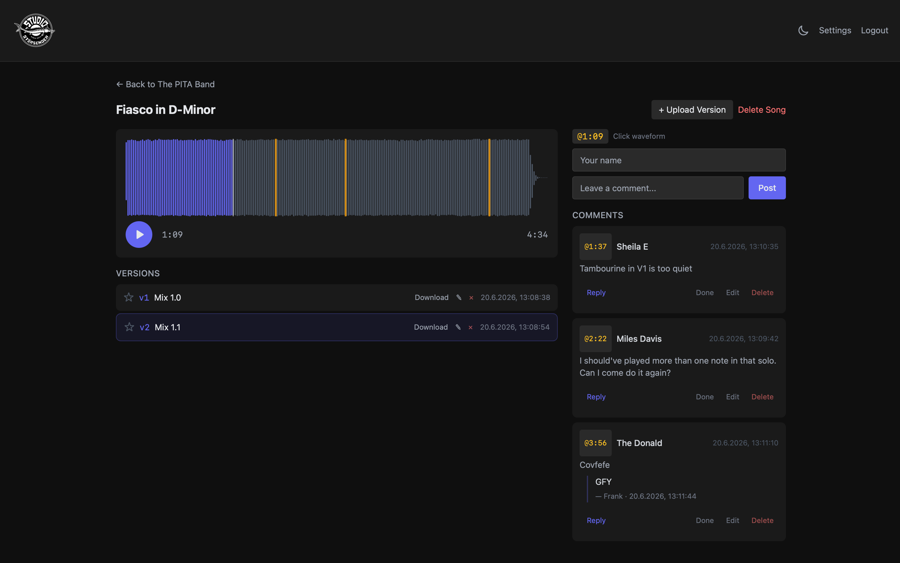

# ReaMark

A self-hosted audio review platform for studios. Clients listen to mix versions and leave timeline-based comments via secure share links.

## Screenshots

**Clients leave timecoded comments right on the waveform — reply, and mark them done as you fix them.**



**The same comments show up inside REAPER (ReaImGui script) — jump to the spot, reply, resolve, without leaving your session.**


**Admin view — projects and songs at a glance.**


## Features

- **Projects & Songs** -- Organize mixes by project with multiple songs and auto-incrementing versions (v1, v2, v3...)
- **Waveform Player** -- Visual waveform with playback, scrubbing, and clickable comment markers
- **Timeline Comments** -- Precise timecode-based comments (@0:45) with nested replies
- **Share Links** -- UUID-based access, no client accounts needed
- **Favourite Versions** -- Star your preferred version per song (auto-selected on switch)
- **Done Workflow** -- Mark comments as resolved, filter by status
- **REAPER Integration** -- ReaImGui script with waveform display, comment management, and calibration
- **VST3 Plugin** -- DAW-independent plugin (JUCE/C++) for Logic, Cubase, Ableton and others with waveform display, comments, and transport sync
- **Email Notifications** -- SMTP/SendGrid/Mailgun support with customizable templates
- **Admin Interface** -- Upload management, project organization, custom theming and logo
- **Audio Formats** -- WAV, MP3, FLAC

## Quick Start

```bash
git clone https://github.com/acklin83/reamark.git
cd reamark
docker-compose up --build -d
```

Visit `http://localhost:8080/admin` to set up your admin password on first run.

## Deployment

### Prebuilt images (no source checkout)

The fastest way to self-host. You only need a single compose file and a secret key — images are pulled from GitHub Container Registry, nothing is built locally.

```bash
curl -O https://raw.githubusercontent.com/acklin83/reamark/main/docker-compose.ghcr.yml
echo "REAMARK_SECRET_KEY=$(openssl rand -hex 32)" > .env
docker compose -f docker-compose.ghcr.yml up -d
```

Open `http://<host>:8080/admin` to set the admin password. Put a reverse proxy with TLS in front (see below), or use the Caddy variant for automatic HTTPS.

### Automatic HTTPS with Caddy

If you have a domain pointing at the host and ports 80 + 443 are reachable, Caddy obtains and renews a Let's Encrypt certificate automatically — no manual cert setup.

```bash
curl -O https://raw.githubusercontent.com/acklin83/reamark/main/docker-compose.caddy.yml
curl -O https://raw.githubusercontent.com/acklin83/reamark/main/Caddyfile
printf "REAMARK_SECRET_KEY=%s\nREAMARK_DOMAIN=mix.example.com\n" "$(openssl rand -hex 32)" > .env
docker compose -f docker-compose.caddy.yml up -d
```

ReaMark is then served at `https://mix.example.com`.

### Configuration

Copy `.env.example` to `.env` and adjust. `REAMARK_SECRET_KEY` is required in production (generate with `openssl rand -hex 32`); `REAMARK_DOMAIN` is only needed for the Caddy variant.

### Branding

Everything is white-label from **Admin > Settings** — no code changes: site name, favicon, logo (with size), accent colour and full dark/light theme palette, plus the email sender name. Settings are stored per instance in the database.

### Synology DiskStation

**Prerequisites:** Docker (Container Manager) installed via Package Center.

```bash
# SSH into DiskStation
ssh user@diskstation

# Clone repository
git clone https://github.com/acklin83/reamark.git /volume1/docker/reamark
cd /volume1/docker/reamark

# Set a secure secret key
export REAMARK_SECRET_KEY=$(openssl rand -hex 32)

# Start services
sudo docker-compose up --build -d
```

**Reverse Proxy (DSM):**

1. Control Panel > Security > Certificate > Add Let's Encrypt certificate for your domain
2. Control Panel > Login Portal > Advanced > Reverse Proxy > Create:

| Setting | Value |
|---------|-------|
| Source Protocol | HTTPS |
| Source Hostname | mix.yourdomain.com |
| Source Port | 443 |
| Destination Protocol | HTTP |
| Destination Hostname | localhost |
| Destination Port | 8080 |

3. Add custom headers:

```
X-Real-IP: $remote_addr
X-Forwarded-For: $proxy_add_x_forwarded_for
X-Forwarded-Proto: $scheme
```

**Updates:**

```bash
cd /volume1/docker/reamark
git pull
sudo docker-compose up --build -d
```

### Linux / VPS

```bash
git clone https://github.com/acklin83/reamark.git /opt/reamark
cd /opt/reamark

# Set secret key
echo "REAMARK_SECRET_KEY=$(openssl rand -hex 32)" > .env

# Start
docker-compose up --build -d
```

For HTTPS, place a reverse proxy (nginx, Caddy, Traefik) in front:

**Caddy (simplest):**
```
mix.yourdomain.com {
    reverse_proxy localhost:8080
}
```

**nginx:**
```nginx
server {
    listen 443 ssl;
    server_name mix.yourdomain.com;

    ssl_certificate /etc/letsencrypt/live/mix.yourdomain.com/fullchain.pem;
    ssl_certificate_key /etc/letsencrypt/live/mix.yourdomain.com/privkey.pem;

    client_max_body_size 500M;

    location / {
        proxy_pass http://localhost:8080;
        proxy_set_header Host $host;
        proxy_set_header X-Real-IP $remote_addr;
        proxy_set_header X-Forwarded-For $proxy_add_x_forwarded_for;
        proxy_set_header X-Forwarded-Proto $scheme;
    }
}
```

### Local Development (without Docker)

```bash
cd backend
python -m venv venv
source venv/bin/activate
pip install -r requirements.txt

# ffmpeg required for waveform generation
# macOS: brew install ffmpeg
# Ubuntu: apt install ffmpeg

uvicorn app.main:app --reload --port 8000
```

Visit `http://localhost:8000/admin`.

## Environment Variables

| Variable | Default | Description |
|----------|---------|-------------|
| `REAMARK_SECRET_KEY` | `change-me-to-a-random-secret` | JWT signing key. Set to a random value in production. |

## REAPER Integration

The included Lua script (`reaper/reamark.lua`) connects REAPER directly to your ReaMark instance.

### Installation

1. Install [ReaImGui](https://forum.cockos.com/showthread.php?t=250419) via ReaPack
2. Copy `reaper/reamark.lua` to your REAPER Scripts folder
3. In REAPER: Actions > Show Action List > Load ReaScript
4. Optionally assign a keyboard shortcut

### Features

- **Login** -- Admin authentication with JWT
- **Project browser** -- Load project by share link, browse songs and versions
- **Waveform display** -- Peak-based waveform with comment markers and real-time playhead
- **Calibration** -- Set song start offset from REAPER cursor position (persisted per song)
- **Comments** -- Create, edit, delete, reply, and resolve comments
- **Jump to timecode** -- Click waveform or comment timestamp to seek in REAPER
- **Autoplay toggle** -- Control whether jumping also starts playback
- **Favourite toggle** -- Star preferred versions
- **Marker tooltips** -- Hover over waveform markers to preview comment text

### Calibration

ReaMark comments use timecodes relative to the song start (0:00 = beginning of the song). In your REAPER project, the song might start at a different position (e.g., bar 5 = 8 seconds in).

1. Place the REAPER edit cursor at the exact point where the song starts
2. Click **Set from Cursor** in the script
3. All timecodes now map correctly between ReaMark and REAPER

The offset is saved per song in the REAPER project file.

## Email Notifications

ReaMark can send email notifications when new comments or replies are posted. See **[EMAIL_DELIVERABILITY.md](./EMAIL_DELIVERABILITY.md)** for complete setup instructions and troubleshooting.

**Quick Setup:**
1. Go to Admin → Settings → Email
2. Choose provider (SMTP, SendGrid, or Mailgun)
3. Configure credentials and sender details
4. **Important:** Set up SPF/DKIM/DMARC DNS records to avoid spam folder (see guide)
5. Test with "Send Test Email" button

**Features:**
- **Batch mode**: Optionally wait X minutes after last comment before sending (combines multiple comments into one email)
- **Song grouping**: Batched emails group comments by song with clear section headers
- **Admin filter**: Comments from admin users never trigger notifications (prevents self-notifications)
- **Per-project control**: Enable/disable notifications individually per project
- **Custom templates**: Create multiple email templates with Jinja2 syntax (DE + EN defaults included)

**Recommended:** Use SendGrid or Mailgun for best deliverability. Self-hosted SMTP often ends up in spam without proper DNS configuration.

## Tech Stack

| Component | Technology |
|-----------|-----------|
| Backend | FastAPI (Python 3.12) |
| Database | SQLite + SQLAlchemy |
| Frontend | Vanilla JS, TailwindCSS, Wavesurfer.js |
| Auth | JWT (admin) + UUID share links (clients) |
| Audio | ffmpeg + pydub (peak generation) |
| REAPER | Lua + ReaImGui |
| VST3 Plugin | JUCE 8 (C++), Universal Binary (arm64+x86_64) |
| Deployment | Docker + Docker Compose + nginx |

## Project Structure

```
reamark/
├── backend/
│   ├── Dockerfile
│   ├── requirements.txt
│   └── app/
│       ├── main.py          # FastAPI application
│       ├── models.py         # SQLAlchemy models
│       ├── schemas.py        # Pydantic schemas
│       ├── database.py       # DB connection
│       ├── auth.py           # JWT + password hashing
│       ├── audio_utils.py    # Peak generation
│       └── routers/
│           ├── admin.py      # Admin CRUD + uploads
│           ├── projects.py   # Client project/audio/peaks endpoints
│           ├── comments.py   # Comment/reply/resolve endpoints
│           └── settings.py   # App settings + theming
├── frontend/
│   ├── admin/                # Admin interface (vanilla JS)
│   └── client/               # Client share link view (vanilla JS)
├── nginx/
│   ├── Dockerfile
│   └── nginx.conf
├── reaper/
│   └── reamark.lua           # REAPER integration script
├── vst3/                     # VST3 plugin (JUCE/C++)
│   ├── CMakeLists.txt
│   ├── Source/               # Plugin source (Processor, Editor, API, Theme, Waveform, Comments)
│   └── docs/                 # Architecture & build docs
├── data/                     # Runtime data (created automatically)
│   ├── uploads/              # Audio files
│   ├── database/             # SQLite DB
│   └── static/               # Generated assets
└── docker-compose.yml
```

## API Overview

### Admin (JWT protected)

```
POST   /admin/auth/setup                    # One-time admin setup
POST   /admin/auth/login                    # Get JWT token
GET    /admin/projects                      # List projects
POST   /admin/projects                      # Create project
GET    /admin/projects/{id}                 # Project details
PUT    /admin/projects/{id}                 # Update project
DELETE /admin/projects/{id}                 # Delete project
POST   /admin/projects/{id}/songs           # Add song
POST   /admin/songs/{id}/versions           # Upload version
PATCH  /admin/versions/{id}/favourite       # Toggle favourite
PUT    /admin/settings                      # Update settings
```

### Client (share link access)

```
GET    /api/projects/{uuid}                          # Project data with songs/versions
GET    /api/projects/{uuid}/comments                 # Comments with replies
POST   /api/projects/{uuid}/comments                 # New comment
POST   /api/projects/{uuid}/comments/{id}/reply      # Reply to comment
PUT    /api/projects/{uuid}/comments/{id}            # Edit comment
DELETE /api/projects/{uuid}/comments/{id}            # Delete comment
PATCH  /api/projects/{uuid}/comments/{id}/resolve    # Toggle resolved (admin)
PATCH  /api/projects/{uuid}/versions/{id}/favourite  # Toggle favourite
GET    /api/audio/{version_id}                       # Stream audio file
GET    /api/versions/{version_id}/peaks              # Waveform peak data (JSON)
```

## License

ReaMark is licensed under the **GNU Affero General Public License v3.0**
(AGPLv3) — see [`LICENSE`](LICENSE) and [`LICENSING.md`](LICENSING.md) for the
rationale and the licenses of bundled components (JUCE, VST3 SDK).

---

Made for [Stoersender-Studio](https://stoersender.ch) in Switzerland.
